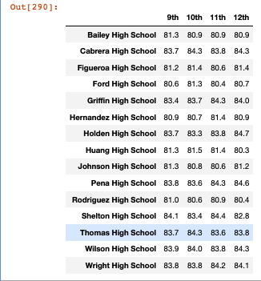
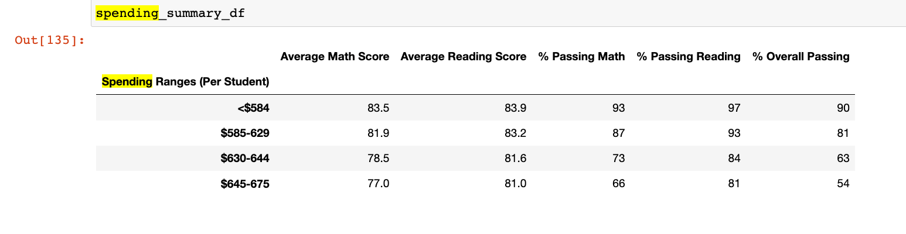

# School_District_Analysis
## <ins> Project Overview and Purpose </ins>
While python in itself is a powerful programming language that can be used to build software, automate tasks, and anaylze data, importing dependecies such as `Pandas` and `NumPy` adds an additional depth of utility that can further help ammend tabulated data and create visualization otutput in the form of data frames as we will discover.

The purpose of this project is to conduct a school district analysis as well as an analysis of hte individual schools themselves using the afformentioned programming language and its dependencies. The data we are analyzing comes in the form of two csv files containing school and student data which provide insight on how well students are performing, the size of school budgets and overall priorities. By merging this information, we are able to evaluate the math and reading grades for Thomas High School students specifically, to untimately indicate whether or not there exists evidence of academic dishonesty, as the grades for ninth grade students appear to have been altered. In order to determine this, a comparative analysis will be completed which will indicate whether replacing math and reading scores for Thomas High School ninth grade students with NaN's (not a number), will affect the overall analysis.

# <ins> Results </ins>
## <ins> How is the district summary affected? <ins>/
There was a negligible change found after the refactorization of the district summary upon replacing 9th grade scores wiht "NaN's". As the district summary summarizes and outputs data on all schools and not that specifically per school as we see in the next section, the results are in line with what we would expect (negligible change), since the redaction of a handfull of students in a large sample (~ 39,000 students) would not have a profund effect on the metrics outputted. The changes that we do see are as follows:
1. :arrow_down: in average my scores by 0.1%
2. :arrow_down: in % passing math by 0.2%
3. :arrow_down: in % passing math by 0.1%
4. :arrow_down: in % overall passing by 0.1%

### Code to replace 9th grade with NaN

### Original District Summary

### Refactored District Summary

## <ins> How is the school summary affected? </ins>
Upon replacing 9th grade students data with "NaN" an output of the summary per school was created. As can be seen from the data drawn up [before](resources/img/per_school_summary_module.png) and [after](resources/img/per_school_summary_refactored.png) there is an overall drop in all metrics pertaining to Thomas High School, save for informataion presenteed in the first five columns as they are not grade/student dependant. Most notably we see the following changes:
1. :arrow_down: in % passing math by 26.36%
2. :arrow_down: in % passing reading by 26.19%
3. :arrow_down: in % overall passing by 25.87%

### Original Per School Summary

### Refactored Per School Summary

## <ins> How does replacing the ninth graders’ math and reading scores affect Thomas High School’s performance relative to the other schools? </ins>
Replacing the ninth graders' math and reading scores with Nan values clearly affects Thomas High School's performance relative to the other schools as could be viewed by the per school summary intally. As already previously mentioned,
1. :arrow_down: in % passing math by 26.36%
2. :arrow_down: in % passing reading by 26.19%
3. :arrow_down: in % overall passing by 25.87%
When sorted by top 5 schools by % overall passing, Thomas High School comes in ranked second place when using the dataset that was all inclusive. However, when substituting "Nan" for the inaccurate values, Thomas High School's standings amongst other schools consiquently drops bringing it's standing compared to the other schools much lower, effectively dropping out of the top 5 performig schools by overall passing completely. 

### Original Top Performing Schools Code

### Original Top Performing Schools

### Thomas High School's % Passing after Excluding False Data

## <ins> How does replacing the ninth-grade scores affect the following: </ins> 
### <ins> Math and reading scores by grade </ins>
The refactored code implicates that all 9th grader scores have been replaced by NaN (example of the code can be seen [here](resources/img/NaN_replacement.png) all other data/results have been left unchanged and will therefore presnt as identical to the original

#### Math Original vs Refactored

  

#### Reading Original vs Refactored

  

 ### <ins> Scores by school spending </ins>

Replacing the ninth-graders scores does not actually affect the scores by schools spending because by the time we run this code, we will have replaced the overall Thomas High School passing scores in the dataframe with data for only the 10th through 12th grade and will not even count the ninth graders data in this analysis. So the scores by school spending dataframe remains unchanged. If we had caclulated this data before updating the frame to only show for 10th through 12th, the school spend per student would be much higher. I noticed in this code, that our challenge didn't ask us to update the dataframe for total students at Thomas High School to show as only 1,173 (1635 - 461 ninth graders). If the code had asked us to update our dataframe for total students from Thomas High School to be only 1,173 (10th Grade to 12th Grade Only), then the total spend per student would be much higher at $889.28 and would bump this school way up on the spending range per student. 

#### Scores by School Spending Original 

  

#### Scores by School Spending Refactored

### <ins> Scores by school size </ins>
When we view the dataframes for scores by school size, we encounter the same phenomenon as we did in the last section (scores by spending), in that the data remains relatively unchanged from the first dataframe to the second, because we eliminated the ninth grader information from the average and passing scores, but the challenge code never asked us to update the total student number. For this reason, and because the 10th-12th graders had relatively the same scores as was counted in the original code with the inaccurate data of the 9th graders, we can see that there is really no difference of output below. Also the school size (even if we subtract the amount of 9th grader students), remains in the Medium Range(1,000 - 2,000). 

#### Scores by School Size Original 

 

#### Scores by School Size Refactored

### <ins> Scores by school type </ins>
In this next section, we again see the same type of outcome that we saw in the previous two sections. The data remains unchanged in the scores by school type because again, we have eliminated the 9th grade null data, and replaced our datasets with only the passing grade info from 10th to 12th grade. If we left the dataset as affected by the null values, we would see a change in the scores, however at the end of the challenge code, we replaced this lower data, with info that shows just from the 10th-12th grades, which bring our scores back to the same as they were originally. 

#### Scores by School Type Original

 

#### Scores by School Type Refactored

# Summary
## Summary of 4 Major Changes in Updated DataFrame
Major changes to the school district analysis after reading and math scores have been replaced are: 
  1) The first replacement of the 9th grade values with Nan bring down all the scores from Thomas High School across the board. But then, at the end of our code, we replace the      school summary code with code that only counts the 10th-12th grade passing data. This brings our data back up. In our final dataframe therefore: 
  2) the grades % increased for Thomas High School so it went from a low performing to a high performing school
  3) the % Passing Math Scores for Thomas High School returned back up to 93 from 66.9 
  4) the % Passing Reading returned back up to 97 from 69.6 
  5) the overall percentage of the passing returned back up to 90 from 65. 
#### Code where we replace DataFrame with values for only 10th-12th. 

#### Before replacing the math & reading scores

#### After replacing the math & reading scores

