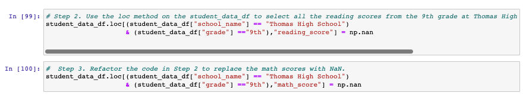
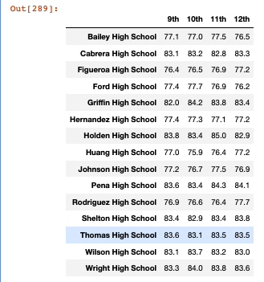
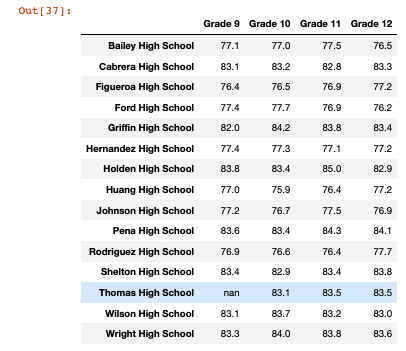
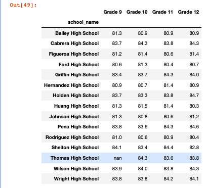
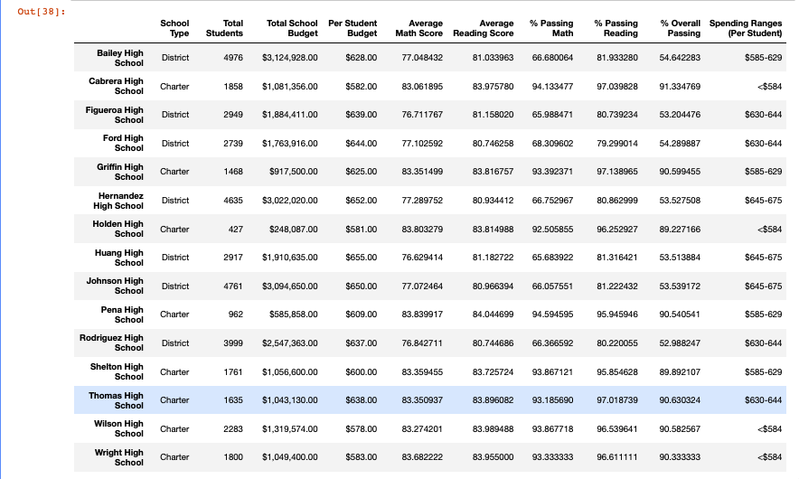

# School_District_Analysis
## <ins> Project Overview and Purpose </ins>
While python in itself is a powerful programming language that can be used to build software, automate tasks, and anaylze data, importing dependecies such as `Pandas` and `NumPy` adds an additional depth of utility that can further help ammend tabulated data and create visualization otutput in the form of data frames as we will discover.

The purpose of this project is to conduct a school district analysis as well as an analysis of hte individual schools themselves using the afformentioned programming language and its dependencies. The data we are analyzing comes in the form of two csv files containing school and student data which provide insight on how well students are performing, the size of school budgets and overall priorities. By merging this information, we are able to evaluate the math and reading grades for Thomas High School students specifically, to untimately indicate whether or not there exists evidence of academic dishonesty, as the grades for ninth grade students appear to have been altered. In order to determine this, a comparative analysis will be completed which will indicate whether replacing math and reading scores for Thomas High School ninth grade students with NaN's (not a number), will affect the overall analysis.

# <ins> Results </ins>
## <ins> How is the district summary affected? </ins>
There was a negligible change found after the refactorization of the district summary upon replacing 9th grade scores wiht "NaN's". As the district summary summarizes and outputs data on all schools and not that specifically per school as we see in the next section, the results are in line with what we would expect (negligible change), since the redaction of a handfull of students in a large sample (~ 39,000 students) would not have a profund effect on the metrics outputted. The changes that we do see are as follows:
1. :arrow_down: in average my scores by 0.1%
2. :arrow_down: in % passing math by 0.2%
3. :arrow_down: in % passing math by 0.1%
4. :arrow_down: in % overall passing by 0.1%

### Code to replace 9th grade with NaN

  

 
### Original District Summary

  

 
### Refactored District Summary

  

## <ins> How is the school summary affected? </ins>
Upon replacing 9th grade students data with "NaN" an output of the summary per school was created. As can be seen from the data drawn up [before](resources/img/per_school_summary_module.png) and [after](resources/img/per_school_summary_refactored.png) there is an overall drop in all metrics pertaining to Thomas High School, save for informataion presenteed in the first five columns as they are not grade/student dependant. Most notably we see the following changes:
1. :arrow_down: in % passing math by 26.36%
2. :arrow_down: in % passing reading by 26.19%
3. :arrow_down: in % overall passing by 25.87%

### Original Per School Summary

  

### Refactored Per School Summary

  

## <ins> How does replacing the ninth graders’ math and reading scores affect Thomas High School’s performance relative to the other schools? </ins>
Replacing the ninth graders' math and reading scores with Nan values clearly affects Thomas High School's performance relative to the other schools as could be viewed by the per school summary intally. As already previously mentioned,
1. :arrow_down: in % passing math by 26.36%
2. :arrow_down: in % passing reading by 26.19%
3. :arrow_down: in % overall passing by 25.87%
When sorted by top 5 schools by % overall passing, Thomas High School comes in ranked second place when using the dataset that was all inclusive. However, when substituting "Nan" for the inaccurate values, Thomas High School's standings amongst other schools consiquently drops bringing it's standing compared to the other schools much lower, effectively dropping out of the top 5 performig schools by overall passing completely. 

### Original Top Performing Schools Code

  

 
### Original Top Performing Schools

  

 
### Thomas High School's % Passing after Excluding False Data

  

## <ins> How does replacing the ninth-grade scores affect the following: </ins> 
### <ins> Math and reading scores by grade </ins>
The refactored code implicates that all 9th grader scores have been replaced by NaN (example of the code can be seen [here](resources/img/NaN_replacement.png) all other data/results have been left unchanged and will therefore presnt as identical to the original

#### Math Original vs Refactored

  

#### Reading Original vs Refactored

  

 ### <ins> Scores by school spending </ins>
Scores by scool spending were minutely affected as follows:
1. ⬆️ in % overall passing by 0.1% for the $630-644 spending bracket
2. :arrow_up: in % overall passing by 0.5% for the $645-675 spending bracket

The data utilized only takes into account passing students at Thomas high from grades 10 through 12 (since all ninth graders data have been replaced with NaN), and it is for ths reason that the data frame remains realtively unchnaged. Should the data frame have been representative of grades 10-12 while taking all 9th graders into account, the amount spent per student would have greatly increased. Had the refactored code reflected the dataset of 1,173 students (1635 (total students) - 461 (ninth graders)) a result of $889.28 would have been calculated and would subsequently increase the standing of Thomas High under comparison against the different schools found within the district

#### Scores by School Spending Original 

  

#### Scores by School Spending Refactored

Furthermore, minimal to no change at all was reported when grouping all schools together according to their school spending (per student) as it relates to average math/reading score, % passing math/reading, and % overall passing upon examination of the [original grouped by spending data frame](resources/img/spending_summary_module.png) against the [refactored grouped by spending data frame](resources/img/spending_summary_refactored.png)

### <ins> Scores by school size </ins>
Data frames for scores according to school size present as unchanged form our original data, the reasoning for this is that ninth grade student data has been ommited (from avg and passing scores).

#### Scores by School Size Original 

 

#### Scores by School Size Refactored

Furthermore, minimal to no change at all was reported when grouping all schools together according to their school size as it relates to average math/reading score, % passing math/reading, and % overall passing upon examination of the [original grouped by size data frame](resources/img/size_summary_module.png) against the [refactored grouped by size data frame](resources/img/size_summary_refactored.png)

### <ins> Scores by school type </ins>
Data frames for scores according to school type present as unchanged form our original data, the reasoning for this is that ninth grade student data has been ommited (from avg and passing scores) leaving only passing information for grades 10-12.

#### Scores by School Type Original

 

#### Scores by School Type Refactored

# Summary
## Summary of 4 Major Changes in Updated DataFrame
Updating the Data frame to show values for Thomas high including only students in the 10th - 12th grades had the follwoing effects:
1. replacing 9th grade values with NaN brought down all the metrics in question save for budget allocation, school size, and type as those variables are independant of the student.

upon updating the data to include 10th-12th grade students we see:
2. ⬆️ % Passing Math Scores for Thomas High School to 93 (initial value of 66.9)
3. ⬆️ % Passing Reading for Thomas High School to 97 (initial value of 69.6)
4. ⬆️ % overall passing for Thomas High School to 90 (initial value of 65) 

